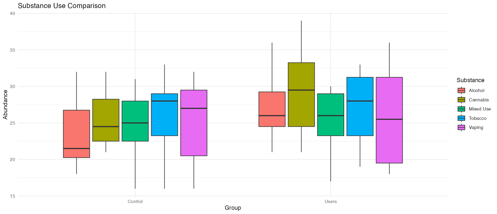

<!-- README.md is generated from README.Rmd. Please edit that file -->

```{r, include = FALSE}
knitr::opts_chunk$set(
  collapse = TRUE,
  comment = "#>",
  fig.path = "man/figures/README-",
  out.width = "100%"
)
```

# OralMicrobiomeSubstanceUse

<!-- badges: start -->

<!-- badges: end -->

## Description

The OralMicrobiomeSubstanceUse package provides tools for analyzing and comparing microbial species in the oral microbiome of individuals who use substances, including tobacco, cannabis, and other drugs. This package is designed to support research on microbial diversity and distribution within substance user groups, helping to identify common or unique microbial species associated with each type of substance use. By facilitating comparisons across different user groups, the package fills a gap in bioinformatics workflows focused on the oral microbiome of substance users.

This package is particularly beneficial for researchers studying the impact of substance use on oral health, as it allows for the visualization of microbial species variations and outputs summary tables that aid in exploring these relationships. The tools offered improve workflows by integrating microbial species data analysis, comparison functions, and visualization capabilities within a single package, streamlining analyses that would otherwise require separate tools and significant manual processing. This package relies on and integrates already existing R packages: rBLAST, phyloseq, rentrez, HMP16SData, ggplot2, plotly, vegan. These packages are integrated into the 10 functions and are extended to fit the goal on this package that is Oral Microbiome in Substance Users specifically.

The package was developed using R version 4.4.1 and on platform x86_6-apple-danwin20 Mac, running under macOS Sonoma 14.3.

## Installation

To use the `OralMicrobiomeSubstanceUse` package and its functionalities, you need to install the package and its dependencies.

### Install Required Packages

Before installing `OralMicrobiomeSubstanceUse`, ensure that the following required packages are installed:

- **CRAN Packages**:
  - `dplyr`
  - `ggplot2`
  - `plotly`
  - `httr`
  - `jsonlite`
  - `rBLAST`

- **Bioconductor Packages**:
  - `HMP16SData`
  - `phyloseq`
  - `SummarizedExperiment`
  - `ExperimentHub`


You can install the development version of OralMicrobiomeSubstanceUse from [GitHub](https://github.com/) with:

``` {r, eval = FALSE}
install.packages(c("dplyr", "ggplot2", "plotly", "httr", "jsonlite", "rBLAST", "shiny"))
```


``` {r}
if (!requireNamespace("BiocManager", quietly = TRUE)) {
  install.packages("BiocManager")
}
BiocManager::install(c("HMP16SData", "phyloseq", "SummarizedExperiment", "ExperimentHub"), force = TRUE)

```


``` {r}
if (!requireNamespace("devtools", quietly = TRUE)) {
  install.packages("devtools")
}
devtools::install_github("Maryam-hkiabi/OralMicrobiomeSubstanceUse", build_vignettes = TRUE)

library(OralMicrobiomeSubstanceUse)


```


#``` {r}
# Install devtools if you haven't already
#install.packages("devtools")
#library("devtools")


#install.packages(c("dplyr", "ggplot2", "plotly", "httr", "jsonlite", "rBLAST"), repos = "https://cran.rstudio.com")

#library("ggplot2")
#library("plotly")
#library("httr")
#library("jsonlite")
#library("rBLAST")


#if (!requireNamespace("BiocManager", quietly = TRUE)) {
#  install.packages("BiocManager")
#}

#BiocManager::install(c("HMP16SData", "phyloseq", "SummarizedExperiment", "ExperimentHub"), force = TRUE)

#library("HMP16SData")
#library("phyloseq")
#library("SummarizedExperiment")
#library("ExperimentHub")


# Install OralMicrobiomeSubstanceUse from GitHub
#devtools::install_github("Maryam-hkiabi/OralMicrobiomeSubstanceUse", build_vignettes = TRUE)

# Load the package
#library("OralMicrobiomeSubstanceUse")

#```

To run the shinyApp: 
``` {r, eval = FALSE}
# Load the package
library(OralMicrobiomeSubstanceUse)

runApp("/Library/Frameworks/R.framework/Versions/4.4-x86_64/Resources/library/OralMicrobiomeSubstanceUse/shiny-scripts/app.R")

# Install Shiny
#install.packages("shiny")
#library("shiny")


# Launch the Shiny app
#runApp("/Library/Frameworks/R.framework/Versions/4.4-x86_64/Resources/library/OralMicrobiomeSubstanceUse/shiny-scripts/app.R")


```


## Overview

``` {r}
# List of all functions and datasets in the package
ls("package:OralMicrobiomeSubstanceUse")

# List of any included datasets, if available
data(package = "OralMicrobiomeSubstanceUse")

# Access the package vignettes for a tutorial
browseVignettes("OralMicrobiomeSubstanceUse")
```

OralMicrobiomeSubstanceUse contains 10 functions:

1)  ***load_data()***

Loads and preprocesses microbiome data from a user-specified file (e.g., CSV, Excel, JSON). This function ensures that the data is correctly formatted for analysis.

2)  ***clean_sequences()***

Cleans and formats raw sequence data to prepare it for BLAST analysis, removing contaminants and standardizing data.

3)  ***run_blast()***

Performs a BLAST search on the provided microbial sequences, querying NCBI to retrieve taxonomic information for each sequence.

4)  ***download_homd_data()***

Retrieves microbial species data from the Human Oral Microbiome Database (HOMD), allowing users to obtain reference data on the human oral microbiome.

5)  ***parse_megan()***

Parses MEGAN output files, extracting taxonomic and functional data. This function is useful for users who have run microbiome analyses in MEGAN and want to integrate the results.

6)  ***compare_groups()***

Compares microbial communities between substance users and non-users, identifying unique or common species between these groups.

7)  ***compare_substances()***

Compares microbial communities across different types of substance users (e.g., smokers vs. cannabis users).

8)  ***species_table()***

Generates a summary table listing microbial species presence and frequency across different substance use types.

9)  ***visualize_taxonomy()***

Creates a bar plot or heatmap to visualize the taxonomic profiles, showing diversity and abundance of species across different groups.

10) ***plot_species_substance()***

Plots the presence and relative abundance of microbial species across different substance use types, providing a visual comparison.

**This package can run on 3 types of datasets:**

1)  user-provided: load own data in JSON, EXCEL or CSV format

2)  sample-dataset: run package on provided sample dataset already inlcuded in this package

3)  retrieve-data: retrieve data directly from Human Oral Microbiome Database (HOMD)


## Example bar graph output


## Example Boxplot of Microbial Communities

 

## Example Taxonomic Profile by Substance Use Type
 


## Contributions 

The author of OralMicrobiomSubstanceUse R package is Maryam Hasanzadehkiabi. The author wrote the 10 functions in this package.This package relies on and integrates already existing R packages: rBLAST, phyloseq, rentrez, HMP16SData, ggplot2, plotly, vegan. These packages are integrated into the 10 functions and are extended to fit the goal on this package that is Oral Microbiome in Substance Users specifically. 

To help with the process of making this package the following were used:

1) course material from BCB420 Fall 2024

2) online textbook R Packages (2e) by Hadley Wickham and Jennifer Bryan

## References

Wickham, H. and J. Bryan (2019). R Packages (2nd edition). Newton, Massachusetts: O’Reilly Media. https://r-pkgs.org/. Accessed 5 November 2024

Silva, Anjali. TestingPackage. GitHub, https://github.com/anjalisilva/TestingPackage. Accessed 5 November 2024.

OpenAI. ChatGPT. Accessed 5 November 2024. 

Wickham H, François R, Henry L, Müller K, Vaughan D (2023). dplyr: A Grammar of Data Manipulation. R package version 1.1.4, https://github.com/tidyverse/dplyr, https://dplyr.tidyverse.org.

Wickham H (2016). ggplot2: Elegant Graphics for Data Analysis. Springer-Verlag New York. ISBN 978-3-319-24277-4, https://ggplot2.tidyverse.org.

Wickham, H. and J. Bryan (2019). R Packages (2nd edition). Newton, Massachusetts: O’Reilly Media. https://r-pkgs.org/

Chang, W., Cheng, J., Allaire, J., Sievert, C., Schloerke, B., Xie, Y., Allen, J., McPherson, J., Dipert, A., Borges, B. (2024). shiny: Web Application Framework for R. R package version 1.9.1, https://CRAN.R-project.org/package=shiny.

Couture-Beil, A. (2024). rjson: JSON for R. R package version 0.2.23. https://CRAN.R-project.org/package=rjson.

Li, J. (2020). configr: An Implementation of Parsing and Writing Configuration File (JSON/INI/YAML/TOML). R package version 0.3.5. https://CRAN.R-project.org/package=configr.


R Core Team (2023). R: A language and environment for statistical computing. R Foundation for Statistical Computing, Vienna, Austria. https://www.R-project.org/

Hahsler M, Nagar A (2024). “rBLAST: R Interface for the Basic Local Alignment Search Tool.” Bioconductor version: Release (3.19). doi:10.18129/B9.bioc.rBLAST, R package version 0.99.4.

McMurdie PJ, Holmes S (2013). “phyloseq: An R package for reproducible interactive analysis and graphics of microbiome census data.” PLoS ONE, 8(4), e61217. http://dx.plos.org/10.1371/journal.pone.0061217.

Winter, D. J. (2017) rentrez: an R package for the NCBI eUtils API The R Journal 9(2):520-526

L. Schiffer, R. Azhar, L. Shepherd, M. Ramos, L. Geistlinger, C. Huttenhower, J. B. Dowd, N. Segata, L.
  Waldron. HMP16SData: Efficient Access to the Human Microbiome Project through Bioconductor. American
  Journal of Epidemiology, kwz006, 01 2019.
  
C. Sievert. Interactive Web-Based Data Visualization with R, plotly, and shiny. Chapman and Hall/CRC
  Florida, 2020.
  
Oksanen J, Simpson G, Blanchet F, Kindt R, Legendre P, Minchin P, O'Hara R, Solymos P, Stevens M, Szoecs
  E, Wagner H, Barbour M, Bedward M, Bolker B, Borcard D, Carvalho G, Chirico M, De Caceres M, Durand S,
  Evangelista H, FitzJohn R, Friendly M, Furneaux B, Hannigan G, Hill M, Lahti L, McGlinn D, Ouellette M,
  Ribeiro Cunha E, Smith T, Stier A, Ter Braak C, Weedon J (2024). _vegan: Community Ecology Package_. R
  package version 2.6-8, <https://CRAN.R-project.org/package=vegan>.


## Acknowledgements

This package was developed as part of an assessment for 2024 BCB410H: Applied Bioinformatics course at the University of Toronto, Toronto, CANADA. By student Maryam Hasanzadehkiabi. OralMicrobiomeSubstanceUse welcomes issues, enhancement requests, and other contributions. To submit an issue, use the GitHub issues.
