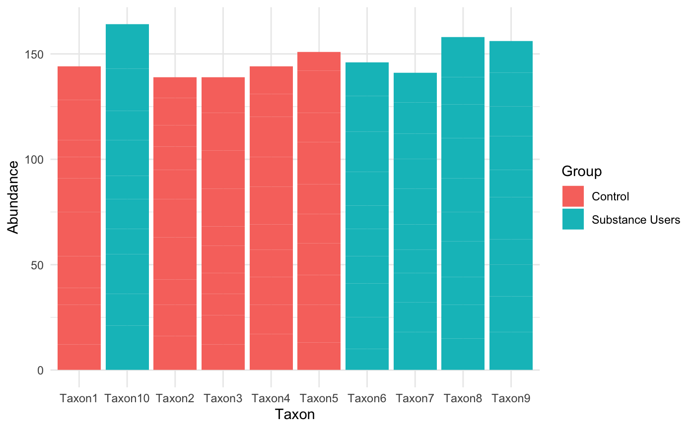
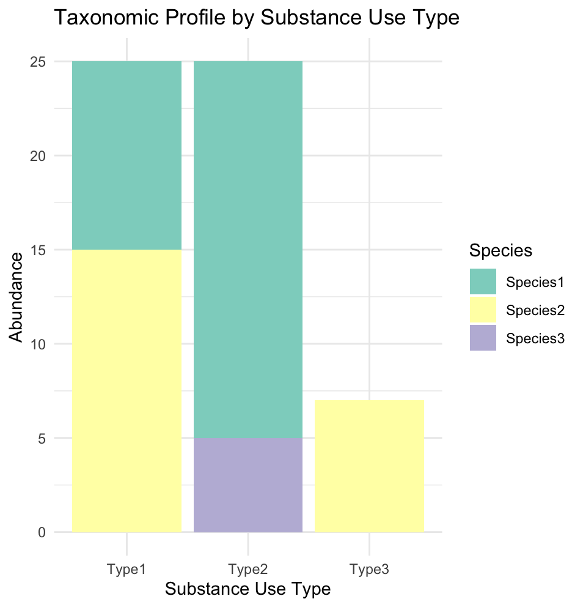

<!-- README.md is generated from README.Rmd. Please edit that file -->

# OralMicrobiomeSubstanceUse

<!-- badges: start -->
<!-- badges: end -->

## Description

The OralMicrobiomeSubstanceUse package provides tools for analyzing and
comparing microbial species in the oral microbiome of individuals who
use substances, including tobacco, cannabis, and other drugs. This
package is designed to support research on microbial diversity and
distribution within substance user groups, helping to identify common or
unique microbial species associated with each type of substance use. By
facilitating comparisons across different user groups, the package fills
a gap in bioinformatics workflows focused on the oral microbiome of
substance users.

This package is particularly beneficial for researchers studying the
impact of substance use on oral health, as it allows for the
visualization of microbial species variations and outputs summary tables
that aid in exploring these relationships. The tools offered improve
workflows by integrating microbial species data analysis, comparison
functions, and visualization capabilities within a single package,
streamlining analyses that would otherwise require separate tools and
significant manual processing. This package relies on and integrates
already existing R packages: rBLAST, phyloseq, rentrez, HMP16SData,
ggplot2, plotly, vegan. These packages are integrated into the 10
functions and are extended to fit the goal on this package that is Oral
Microbiome in Substance Users specifically.

The package was developed using R version 4.4.1 and on platform
x86_6-apple-danwin20 Mac, running under macOS Sonoma 14.3.

## Installation

To use the `OralMicrobiomeSubstanceUse` package and its functionalities,
you need to install the package and its dependencies.

### Install Required Packages

Before installing `OralMicrobiomeSubstanceUse`, ensure that the
following required packages are installed:

- **CRAN Packages**:
  - `dplyr`
  - `ggplot2`
  - `plotly`
  - `httr`
  - `jsonlite`
  - `rBLAST`
- **Bioconductor Packages**:
  - `HMP16SData`
  - `phyloseq`
  - `SummarizedExperiment`
  - `ExperimentHub`

You can install the development version of OralMicrobiomeSubstanceUse
from [GitHub](https://github.com/) with:

``` r
install.packages(c("dplyr", "ggplot2", "plotly", "httr", "jsonlite", "rBLAST", "shiny"))
```

``` r
if (!requireNamespace("BiocManager", quietly = TRUE)) {
  install.packages("BiocManager")
}
BiocManager::install(c("HMP16SData", "phyloseq", "SummarizedExperiment", "ExperimentHub"), force = TRUE)
#> Bioconductor version 3.19 (BiocManager 1.30.25), R 4.4.1 (2024-06-14)
#> Installing package(s) 'HMP16SData', 'phyloseq', 'SummarizedExperiment',
#>   'ExperimentHub'
#> 
#> The downloaded binary packages are in
#>  /var/folders/_4/njpp9gxn5jbg5_44_7hgx14h0000gn/T//RtmpZZTmeu/downloaded_packages
#> installing the source package 'HMP16SData'
```

``` r
if (!requireNamespace("devtools", quietly = TRUE)) {
  install.packages("devtools")
}
devtools::install_github("Maryam-hkiabi/OralMicrobiomeSubstanceUse", build_vignettes = TRUE)
#> Skipping install of 'OralMicrobiomeSubstanceUse' from a github remote, the SHA1 (9373aed4) has not changed since last install.
#>   Use `force = TRUE` to force installation

library(OralMicrobiomeSubstanceUse)
```

To run the shinyApp:

``` r
# Load the package
library(OralMicrobiomeSubstanceUse)

runApp("/Library/Frameworks/R.framework/Versions/4.4-x86_64/Resources/library/OralMicrobiomeSubstanceUse/shiny-scripts/app.R")
```

## Overview

``` r
# List of all functions and datasets in the package
ls("package:OralMicrobiomeSubstanceUse")
#>  [1] "clean_sequences"        "compare_groups"         "compare_substances"    
#>  [4] "download_homd_data"     "load_data"              "parse_megan"           
#>  [7] "plot_species_substance" "run_blast"              "sample_data"           
#> [10] "sample_data2"           "species_table"          "substance_use_data"    
#> [13] "visualize_taxonomy"

# List of any included datasets, if available
data(package = "OralMicrobiomeSubstanceUse")

# Access the package vignettes for a tutorial
browseVignettes("OralMicrobiomeSubstanceUse")
#> starting httpd help server ... done
```

OralMicrobiomeSubstanceUse contains 10 functions:

1)  ***load_data()***

Loads and preprocesses microbiome data from a user-specified file (e.g.,
CSV, Excel, JSON). This function ensures that the data is correctly
formatted for analysis.

2)  ***clean_sequences()***

Cleans and formats raw sequence data to prepare it for BLAST analysis,
removing contaminants and standardizing data.

3)  ***run_blast()***

Performs a BLAST search on the provided microbial sequences, querying
NCBI to retrieve taxonomic information for each sequence.

4)  ***download_homd_data()***

Retrieves microbial species data from the Human Oral Microbiome Database
(HOMD), allowing users to obtain reference data on the human oral
microbiome.

5)  ***parse_megan()***

Parses MEGAN output files, extracting taxonomic and functional data.
This function is useful for users who have run microbiome analyses in
MEGAN and want to integrate the results.

6)  ***compare_groups()***

Compares microbial communities between substance users and non-users,
identifying unique or common species between these groups.

7)  ***compare_substances()***

Compares microbial communities across different types of substance users
(e.g., smokers vs. cannabis users).

8)  ***species_table()***

Generates a summary table listing microbial species presence and
frequency across different substance use types.

9)  ***visualize_taxonomy()***

Creates a bar plot or heatmap to visualize the taxonomic profiles,
showing diversity and abundance of species across different groups.

10) ***plot_species_substance()***

Plots the presence and relative abundance of microbial species across
different substance use types, providing a visual comparison.

**This package can run on 3 types of datasets:**

1)  user-provided: load own data in JSON, EXCEL or CSV format

2)  sample-dataset: run package on provided sample dataset already
    inlcuded in this package

3)  retrieve-data: retrieve data directly from Human Oral Microbiome
    Database (HOMD)

## Example bar graph output



## Example Boxplot of Microbial Communities


## Example Taxonomic Profile by Substance Use Type



## Contributions

The author of OralMicrobiomSubstanceUse R package is Maryam
Hasanzadehkiabi. The author wrote the 10 functions in this package.This
package relies on and integrates already existing R packages: rBLAST,
phyloseq, rentrez, HMP16SData, ggplot2, plotly, vegan. These packages
are integrated into the 10 functions and are extended to fit the goal on
this package that is Oral Microbiome in Substance Users specifically.

To help with the process of making this package the following were used:

1)  course material from BCB420 Fall 2024

2)  online textbook R Packages (2e) by Hadley Wickham and Jennifer Bryan

## References

Wickham, H. and J. Bryan (2019). R Packages (2nd edition). Newton,
Massachusetts: O’Reilly Media. <https://r-pkgs.org/>. Accessed 5
November 2024

Silva, Anjali. TestingPackage. GitHub,
<https://github.com/anjalisilva/TestingPackage>. Accessed 5 November
2024.

OpenAI. ChatGPT. Accessed 5 November 2024.

Wickham H, François R, Henry L, Müller K, Vaughan D (2023). dplyr: A
Grammar of Data Manipulation. R package version 1.1.4,
<https://github.com/tidyverse/dplyr>, <https://dplyr.tidyverse.org>.

Wickham H (2016). ggplot2: Elegant Graphics for Data Analysis.
Springer-Verlag New York. ISBN 978-3-319-24277-4,
<https://ggplot2.tidyverse.org>.

Wickham, H. and J. Bryan (2019). R Packages (2nd edition). Newton,
Massachusetts: O’Reilly Media. <https://r-pkgs.org/>

Chang, W., Cheng, J., Allaire, J., Sievert, C., Schloerke, B., Xie, Y.,
Allen, J., McPherson, J., Dipert, A., Borges, B. (2024). shiny: Web
Application Framework for R. R package version 1.9.1,
<https://CRAN.R-project.org/package=shiny>.

Couture-Beil, A. (2024). rjson: JSON for R. R package version 0.2.23.
<https://CRAN.R-project.org/package=rjson>.

Li, J. (2020). configr: An Implementation of Parsing and Writing
Configuration File (JSON/INI/YAML/TOML). R package version 0.3.5.
<https://CRAN.R-project.org/package=configr>.

R Core Team (2023). R: A language and environment for statistical
computing. R Foundation for Statistical Computing, Vienna, Austria.
<https://www.R-project.org/>

Hahsler M, Nagar A (2024). “rBLAST: R Interface for the Basic Local
Alignment Search Tool.” Bioconductor version: Release (3.19).
<doi:10.18129/B9.bioc.rBLAST>, R package version 0.99.4.

McMurdie PJ, Holmes S (2013). “phyloseq: An R package for reproducible
interactive analysis and graphics of microbiome census data.” PLoS ONE,
8(4), e61217. <http://dx.plos.org/10.1371/journal.pone.0061217>.

Winter, D. J. (2017) rentrez: an R package for the NCBI eUtils API The R
Journal 9(2):520-526

L. Schiffer, R. Azhar, L. Shepherd, M. Ramos, L. Geistlinger, C.
Huttenhower, J. B. Dowd, N. Segata, L. Waldron. HMP16SData: Efficient
Access to the Human Microbiome Project through Bioconductor. American
Journal of Epidemiology, kwz006, 01 2019.

C. Sievert. Interactive Web-Based Data Visualization with R, plotly, and
shiny. Chapman and Hall/CRC Florida, 2020.

Oksanen J, Simpson G, Blanchet F, Kindt R, Legendre P, Minchin P, O’Hara
R, Solymos P, Stevens M, Szoecs E, Wagner H, Barbour M, Bedward M,
Bolker B, Borcard D, Carvalho G, Chirico M, De Caceres M, Durand S,
Evangelista H, FitzJohn R, Friendly M, Furneaux B, Hannigan G, Hill M,
Lahti L, McGlinn D, Ouellette M, Ribeiro Cunha E, Smith T, Stier A, Ter
Braak C, Weedon J (2024). *vegan: Community Ecology Package*. R package
version 2.6-8, <https://CRAN.R-project.org/package=vegan>.

Pagès H, Aboyoun P, Gentleman R, DebRoy S (2024). Biostrings: Efficient
manipulation of biological strings. R package version 2.74.0,
<https://bioconductor.org/packages/Biostrings>.

Morgan M, Shepherd L (2024). ExperimentHub: Client to access
ExperimentHub resources. R package version 2.14.0.

Morgan M, Obenchain V, Hester J, Pagès H (2024). SummarizedExperiment: A
container (S4 class) for matrix-like assays. R package version 1.36.0,
<https://bioconductor.org/packages/SummarizedExperiment>.

H. Wickham. ggplot2: Elegant Graphics for Data Analysis. Springer-Verlag
New York, 2016.

Wickham H (2023). *httr: Tools for Working with URLs and HTTP*. R
package version 1.4.7, <https://CRAN.R-project.org/package=httr>.

Bache S, Wickham H (2022). *magrittr: A Forward-Pipe Operator for R*. R
package version 2.0.3, <https://CRAN.R-project.org/package=magrittr>.

phyloseq: An R package for reproducible interactive analysis and
graphics of microbiome census data. Paul J. McMurdie and Susan Holmes
(2013) PLoS ONE 8(4):e61217.

C. Sievert. Interactive Web-Based Data Visualization with R, plotly, and
shiny. Chapman and Hall/CRC Florida, 2020.

Hahsler M, Anurag N (2024). *rBLAST: R Interface for the Basic Local
Alignment Search Tool*. <doi:10.18129/B9.bioc.rBLAST>
<https://doi.org/10.18129/B9.bioc.rBLAST>, R package version 1.0.0,
<https://bioconductor.org/packages/rBLAST>.

Wickham H, Hester J, Bryan J (2024). *readr: Read Rectangular Text
Data*. R package version 2.1.5,
<https://CRAN.R-project.org/package=readr>.

Wickham H, Bryan J (2023). *readxl: Read Excel Files*. R package version
1.4.3, <https://CRAN.R-project.org/package=readxl>.

Winter, D. J. (2017) rentrez: an R package for the NCBI eUtils API The R
Journal 9(2):520-526

R Core Team (2024). *R: A Language and Environment for Statistical
Computing*. R Foundation for Statistical Computing, Vienna, Austria.
<https://www.R-project.org/>.

Wickham H, Vaughan D, Girlich M (2024). *tidyr: Tidy Messy Data*. R
package version 1.3.1, <https://CRAN.R-project.org/package=tidyr>.

Oksanen J, Simpson G, Blanchet F, Kindt R, Legendre P, Minchin P, O’Hara
R, Solymos P, Stevens M, Szoecs E, Wagner H, Barbour M, Bedward M,
Bolker B, Borcard D, Carvalho G, Chirico M, De Caceres M, Durand S,
Evangelista H, FitzJohn R, Friendly M, Furneaux B, Hannigan G, Hill M,
Lahti L, McGlinn D, Ouellette M, Ribeiro Cunha E, Smith T, Stier A, Ter
Braak C, Weedon J (2024). *vegan: Community Ecology Package*. R package
version 2.6-8, <https://CRAN.R-project.org/package=vegan>.

Ooms J (2014). “The jsonlite Package: A Practical and Consistent Mapping
Between JSON Data and R Objects.” *arXiv:1403.2805 \[stat.CO\]*.
<https://arxiv.org/abs/1403.2805>.

Wickham H, Hester J, Ooms J (2023). *xml2: Parse XML*. R package version
1.3.6, <https://CRAN.R-project.org/package=xml2>.

## Acknowledgements

This package was developed as part of an assessment for 2024 BCB410H:
Applied Bioinformatics course at the University of Toronto, Toronto,
CANADA. By student Maryam Hasanzadehkiabi. OralMicrobiomeSubstanceUse
welcomes issues, enhancement requests, and other contributions. To
submit an issue, use the GitHub issues.
